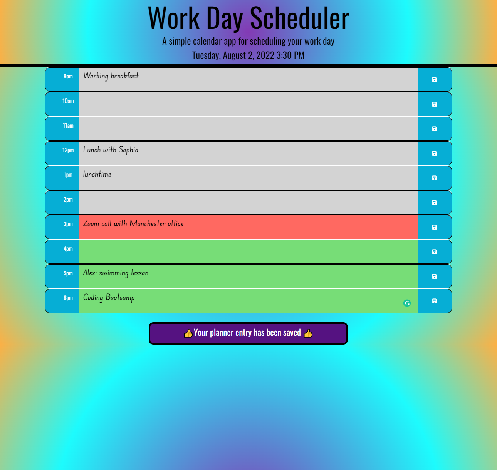

# Third Party APIs Challenge: Work Day Scheduler

This challenge forms part of the course work for week 5, Module 5, set by the University of Birmingham and Trilogy Ltd's Coding Bootcamp.

## Project Description
---

The aim of this challenge was to create a calander application that allows a user to save events for each working hour of the day.
## Project Requirements
---
This challenge required the app to run in the browswer and include dynamically updated HTML and CSS powered by JQurey and the Moments library in order to work with date and time. HTML and CSS files were provided as starter code.

<a href="https://github.com/coding-boot-camp/super-disco"> Link to the starter code repository</a>

 
###  Mock-up of Work Way Schedular App

The following animation was provided as an example to show the  appearance and functionality needed to meet the criteria of this challenge.


The functionality that the work day schedular app was required to  implement, is defined by the user story and acceptance criteria listed below.  


### User Story
```md
AS AN employee with a busy schedule
I WANT to add important events to a daily planner
SO THAT I can manage my time effectively

```


### Acceptance Criteria
```md
GIVEN I am using a daily planner to create a schedule
WHEN I open the planner
THEN the current day is displayed at the top of the calendar
WHEN I scroll down
THEN I am presented with timeblocks for standard business hours
WHEN I view the timeblocks for that day
THEN each timeblock is color coded to indicate whether it is in the past, present, or future
WHEN I click into a timeblock
THEN I can enter an event
WHEN I click the save button for that timeblock
THEN the text for that event is saved in local storage
WHEN I refresh the page
THEN the saved events persist
```


## Approach 
---

### Saving user entered diary events to local storage

#### Traversing the DOM to select time block and the `<textarea>` element assocaiated with the save button event:

The time block save-buttons share the same event handler; when a user clicks the save-button we need to be able to select the `<textarea>` element in the time block corresponding to the save-button clicked by the user, in order to determine in which hour time block the save event occurred.  The HTML code snippet below shows the HTML elements used to construct each hour time block.

```html
<div class="row time-block" id="9" data-id="9">
        <div class="col-sm-1 hour" >
          9am
        </div>
        <textarea class="col-sm-10 description"></textarea>
        <button class="button col-sm-1 saveBtn"><i class="fas fa-save"></i></button>                 
      </div>
```


In order to select the user `<testarea>` element corresponding to the time block where the save-button event occurred, the DOM needs to be traversed backwards from the save-button element, upwards, in order to reach the `<textarea>` element to obtain the user entered text. I used the JQuery click method and the `$(this)` selector to reference the button and chained it with the JQuery `prev()` and `val()` methods to assign the contents of `<textarea>` to a `let` variable.

The hour now needs to be linked with the text – I used data attributes in the time block `<div>` container  and set their value to a number that represents the hour and used `$(this)` chained with the `parent()` and `attr()` methods to select the value of the data attribute (data-id). The data-id  and text variables are then passed to the `storeDiaryText()` function, which saves the data associated with the time block to local storage.

#### Storing time block text to local storage

In addition to meeting the user requirement of storing time block events to local storage, I also implemented additional functionality to remove items from local storage if older than a day, since the schedular holds events for the curernt day only.

The information corresponding to each time block is stored in local storage in an array of objects in JSON format. Prior to storing information in local storage, a conditional check is made to determine if an array already exists in local storage. If not, an empty array is added to local storage. On the condition that an array exists in local storage, the local storage array is parsed using the `JSON.parse()` method to convert it back to JS notation and then stored  in a local variable called `storedDiaryEvents`.  

 The next step is to search `storedDiaryEvents` to determine if a corresponding entry exists to the hour block for which the ‘save’ event occurred.  Initially, I used a for loop and a number of conditional statements to implement this functionality, however, after researching JQuery methods I found an alternative solution – the `findIndex()` method which drastically reduced the lines of code.   The `findIndex()` JQuery method searches through an array and returns the index of the first matching entry, if no entry is found -1 is returned.  This method is suitable for my implementation, since I ensure that only one entry for each time block is maintained in the stored array. The following functionality is then carried out:

- If an entry is found, this means the user has edited a diary event that has already been saved for the day, and in this case, the corresponding object ‘text’ property is updated, the array is converted to JSON format using the `JSONstringfy()` method and saved to local storage.
- Else if no entry exists in the array a new object is added to the array. The object properties are:
  - hour: holds a number which corresponds to the time block hour
  - text: holds the text entered by the user
  - date: holds the date when the object was created  (from Moments library)
- A message is displayed to the user for two seconds by adding a CSS class to the message `<div>` element which then displays the message for 2 seconds, after which the display class is removed from the message element. 
- The local copy of the stored array is converted back to JSON format using `JSON.stringfy()` and then saved to local storage.
- Finally, the `renderDiaryEntries()` function is called to render the text to the screen.

### Displaying user entered text.

The `renderDiaryEntries()` function displays the text entered and saved by the user, the stored array is retrieved from local storage, converted from JSON format using `JSONparse()`,stored in a local variable and then using a for loop, the following functionality is carried out based on conditional checks:

- If the date of an array object is equal to the current date then the text entry can be displayed to the screen. The object hour entry is concatenated with the id selector from the time block `<div>` and using the JQuery id selector and chaining element selectors, the `<textarea>` is selected. The stored text is now assigned to the `<textarea>` and displayed to screen.  
- Else If the object in the array is older than the current date it is not displayed, instead the entry is deleted since it is out-of-date. 

### Time Block Status

Each time block is colour coded grey, red and green to indicate whether it is in the past, present or future respectively, in relation to current time.  In order to update the colour of the time blocks, according to the current time (obtained from Moments library), the `updateTimeBlocks()` function executes a for loop which iterates through each of the time block `<div>` container elements. Depending on conditional checks, th following functionality is carried out at loop each iteration:
 
- If the data-id value in the parent container is less than the current hour this means the time block is in the past, assign the past class to the parent element – this will turn the block grey.  Remove the other classes from the parent element
- If the data-id value in the parent container equal to the current hour this means the time block is current, assign the present class to the parent element – this will turn the block red.  Remove the other classes from the parent element.

In order to ensure that the colour of the time blocks changes according to the current hour, the `setInterval()` function is used to call the `updateTImeBlocks()` function every 30 seconds. 


 
## Usage
---
- Open the <a href="https://beanalini.github.io/funkyMonkeyTime/">Work Day Schedular App.</a>
- Enter your diary events into the time block and save them by clicking on the floppy disk icon on the lefthandside of the time block.
- A message will be displayed for two seconds to indicate that your event has been saved to local storage.  If  the Work Day Schedular browser page is closed, the events will reload next time you enter the app on the same day.
- Time Blocks are colour coded grey, red, and green corresponding to whether it is in the past, present or furture in relation to the current time.
- The event schedular entries will be stored for the current day only, allowing new diary events to be entered into the schedular the following day.   
- This app is responsive and can be used across all devices.


##  Work Day Schedular Screen Shots
---

The Screen shot below displays the Work Day Shedular landing page with saved diary entries.


The screen shot below shows an additional entry made at 6pm and the message which is dipayed when the user clicks on the save button. The save message persits for 2 seconds.




The screen shot below shows the work day schedular landing page presented to the user when it is accessed before 9am  - all the previous days entries saved to local storage are deleted, and the user is able to add new entries.   


---

<a href="https://beanalini.github.io/funkyMonkeyTime/">Link to the deployed website </a>


<a href="https://github.com/Beanalini/funkyMonkeyTime"> Link to the Work Day Schedular app repository</a>

## Technologies Used
---
- HTML
- CSS
- JavaScript
- JQuery
- Moments Library
- Bootstrap
