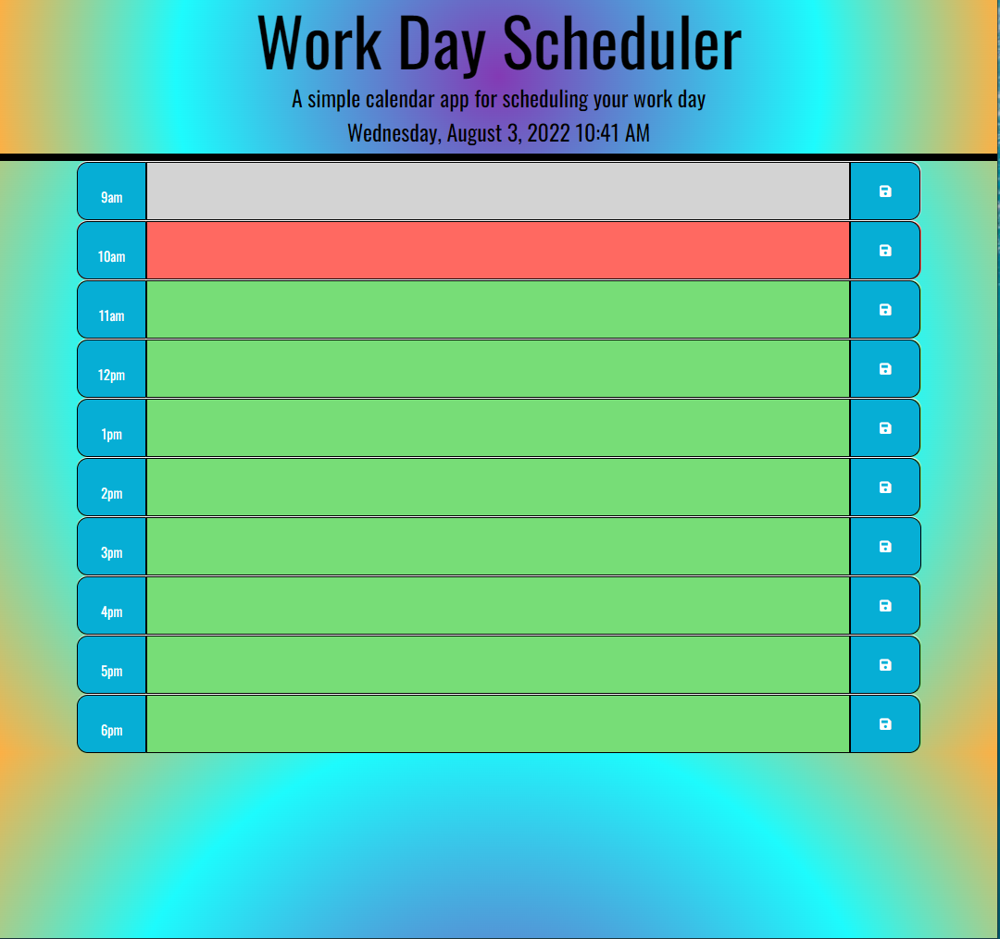

# Third Party APIs Challenge: Work Day Scheduler

This challenge forms part of the course work for week 5, Module 5, set by the University of Birmingham and Trilogy Ltd's Coding Bootcamp.

## Project Description
---

The aim of this challenge was to create a calander application that allows a user to save events for each working hour of the day.
## Project Requirements
---
This challenge required the app to run in the browswer and include dynamically updated HTML and CSS powered by JQurey and the Moments library in order to work with date and time. HTML and CSS files were provided as starter code.

<a href="https://github.com/coding-boot-camp/super-disco"> Link to the starter code repository</a>

 
###  Mock-up of Work Way Schedular App

The following animation was provided as an example to show the  appearance and functionality needed to meet the criteria of this challenge.


The functionality that the work day schedular app was required to  implement, is defined by the user story and acceptance criteria listed below.  


### User Story
```md
AS AN employee with a busy schedule
I WANT to add important events to a daily planner
SO THAT I can manage my time effectively

```


### Acceptance Criteria
```md
GIVEN I am using a daily planner to create a schedule
WHEN I open the planner
THEN the current day is displayed at the top of the calendar
WHEN I scroll down
THEN I am presented with timeblocks for standard business hours
WHEN I view the timeblocks for that day
THEN each timeblock is color coded to indicate whether it is in the past, present, or future
WHEN I click into a timeblock
THEN I can enter an event
WHEN I click the save button for that timeblock
THEN the text for that event is saved in local storage
WHEN I refresh the page
THEN the saved events persist
```


## Approach 
---


 
## Usage
---
- Open the <a href="https://beanalini.github.io/funkyMonkeyTime/">Work Day Schedular App.</a>


##  Work Day Schedular Screen Shots
---

The Screen shot below displays the Work Day Shedular landing page with saved diary entries.


The screen shot below shows an additional entry made at 6pm and the message which is dipayed when the user clicks on the save button. The save message persits for 2 seconds.


The screen shot below shows the work day schedular landing page presented to the user when it is accessed before 9am  - all the previous days entries saved to local storage are deleted, and the user is able to add new entries.   




---

<a href="https://beanalini.github.io/funkyMonkeyTime/">Link to the deployed website </a>


<a href="https://github.com/Beanalini/funkyMonkeyTime"> Link to the Work Day Schedular app repository</a>

## Technologies Used
---
- HTML
- CSS
- JavaScript
- JQuery
- Moments Library
- Bootstrap
